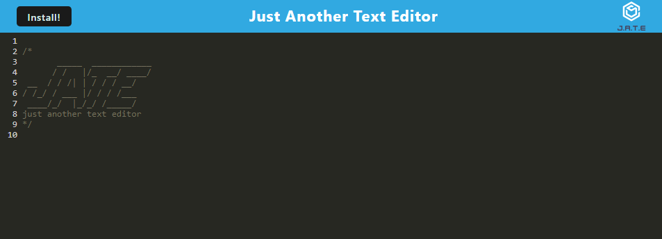

# README Generator

  

  # Description
This is a text editing application that can be used online, offline, or downloadable. Utilizing indexedDB to store the data on the client side and it utilized webpacks to bundle the assets. 

  # Table of Contents
  * [Installation](#installation)
  * [Usage](#usage)
  * [Questions](#questions)
  
  # Installation
  The following necessary dependencies must be installed to run the application

    npm install

  # Usage
  In order to use this app, you will need to make sure you have node.js installed to your Visual Studio Code. One you have installed the necessary dependancies, execute npm start to your application.  

  A link to the deployed application is found [here.](https://text-editor-2.herokuapp.com/)

  # Questions
  If you have any questions about the repository, please contact/email benny.le890@gmail.com  
  My GitHub profile is found at [GitHub Profile](https//GitHub.com/bennyle890)